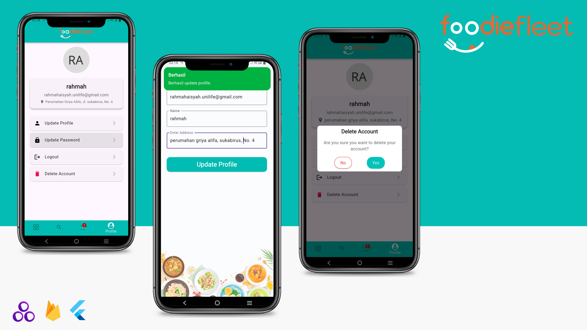

# 🍽️FoodieFleet

## 📌 Deskripsi Aplikasi
FoodieFleet adalah aplikasi mobile berbasis Flutter yang dirancang untuk membantu pengguna menemukan dan memesan makanan dengan mudah. Aplikasi ini menyediakan fitur pencarian restoran terdekat, rekomendasi makanan baru, serta pengelolaan profil pengguna.

Aplikasi ini dikembangkan sebagai bagian dari tugas pengembangan Flutter dengan menerapkan konsep-konsep fundamental seperti autentikasi, state management, dan penggunaan reusable widget guna menciptakan pengalaman pengguna yang optimal.

## 🎥 Demo Aplikasi
📺 [Lihat di YouTube](https://youtu.be/qmsUXmkB9pE)

## 📸 Preview Aplikasi

<p align="center">
   
  
  
</p>

## 🚀 Fitur Utama
### 1. **Splash Screen**
- Menggunakan package **flutter_native_splash** untuk menampilkan layar pembuka saat aplikasi pertama kali dijalankan.

### 2. **Autentikasi Pengguna**
- Implementasi login dan registrasi menggunakan **Firebase Authentication**.
- Mendukung verifikasi email untuk keamanan tambahan.

### 3. **Local Storage**
- Menggunakan **Get Storage** untuk menyimpan data login pengguna.
- Memungkinkan pengguna tetap login meskipun aplikasi ditutup dan dibuka kembali.

### 4. **CRUD (Create, Read, Update, Delete)**
- CRUD diterapkan pada **halaman profil pengguna**, meliputi:
  - Membuat profil pengguna.
  - Menambahkan alamat.
  - Mengubah nama dan alamat.
  - Menghapus profil pengguna.
- Data disimpan menggunakan **Firebase Firestore**.

### 5. **Fitur Rekomendasi & Pencarian Restoran**
- Pengguna dapat mencari restoran terdekat berdasarkan lokasi.
- Menyediakan rekomendasi makanan baru berdasarkan kategori.
- Memungkinkan pengguna untuk menemukan makanan baru di sekitar mereka.

### 6. **State Management**
- Menggunakan **GetX** sebagai state management utama untuk efisiensi dan kemudahan pengelolaan data.

### 7. **Struktur Folder**
- Menggunakan **Get CLI** untuk memastikan setiap halaman memiliki struktur **MVC** (Model-View-Controller).
- Memastikan pemisahan kode yang jelas untuk kemudahan pemeliharaan dan pengembangan.

## 🛠 Teknologi yang Digunakan
- **Flutter** (Framework utama)
- **Firebase Authentication** (Login, Registrasi, Verifikasi Email)
- **Firebase Firestore** (Menyimpan data pengguna)
- **GetX** (State management dan dependency injection)
- **Get Storage** (Local Storage)
- **flutter_native_splash** (Splash Screen)
- **Flutter ScreenUtil** (Memastikan responsivitas UI pada berbagai ukuran layar)
- **Lottie** (Animasi interaktif untuk tampilan lebih menarik)
- **SDK 23** sebagai minimum SDK yang digunakan

## ⚡ Cara Menjalankan Aplikasi
1. **Clone repository**
   ```sh
   git clone https://github.com/Mobile-Innovation-Laboratory/Flutter_RahmahAisyah_FoodieFleet.git
   cd foodie_fleet_app
   ```
2. **Install dependencies**
   ```sh
   flutter pub get
   ```
3. **Konfigurasi Firebase**
   - Buat project di Firebase.
   - Unduh file **google-services.json** dan letakkan di folder `android/app/`.
   - Aktifkan Firebase Authentication dan Firestore di Firebase Console.
4. **Jalankan aplikasi**
   ```sh
   flutter run
   ```


